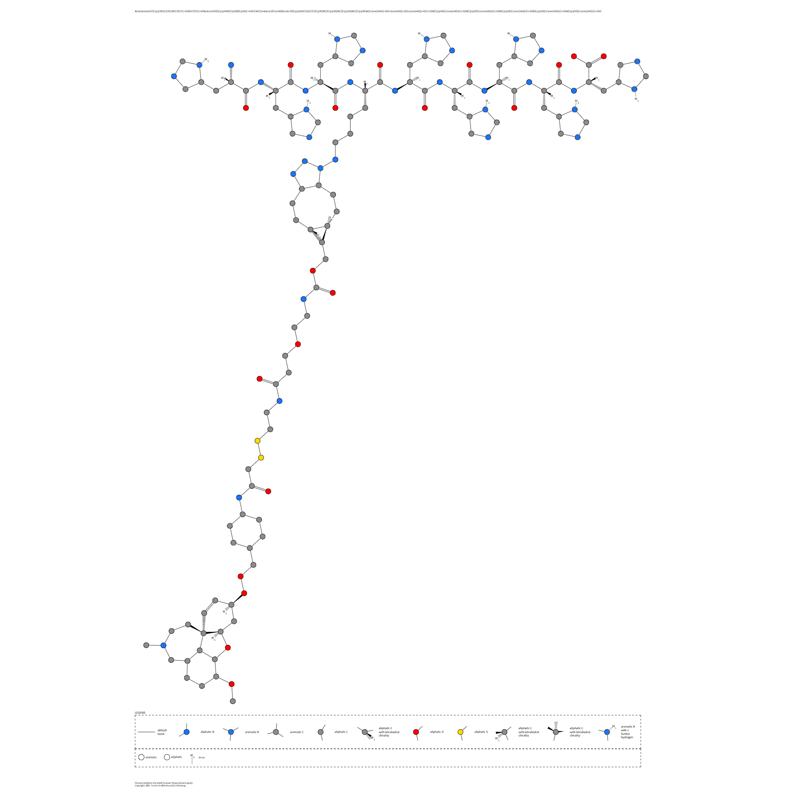

# Click Chemistry Pipeline

A simple Python pipeline for **drug-linker-nanobody conjugation** using **RDKit** for SMILES processing, click reaction simulation, and property evaluation. Automatically selects the best linker from a JSON library and generates the final conjugated SMILES.

---

## 🚀 Requirements

* **Docker** (for containerized execution)
* **Python 3.12+** with `rdkit`, `pandas`, `matplotlib` (handled in Docker)

---

## ⚙️ Quick Start

### 1. Build Docker Image

```bash
docker build -t click-chemistry .
```

### 2. Run Pipeline (outputs saved to `./outputs/`)

```bash
mkdir -p outputs
docker run -v $(pwd)/outputs:/app/outputs -it click-chemistry python main.py --manual_smiles "YOUR_SMILES_HERE"
```

**Example SMILES:**

```
[H][C@]12C[C@@H](O)C=C[C@]11CCN(C)CC3=C1C(O2)=C(OC)C=C3
```

⏱️ Runtime: ~5–10 min for 106 linkers.

---

## 📦 Outputs

* `outputs/final_best_smiles.txt` → Final conjugated SMILES
* `outputs/final_report.json` → Best linker details, properties, and scores
* **Console Output:** Properties table and logs

---

## 📁 Files Overview

* `main.py` → Entry point (argument: `--manual_smiles`)
* `config.py`, `utils.py`, etc. → Core logic
* `merged_starred_linkers.json` → Linker library (106 entries)

---

## 🧪 Notes

* To use a default SMILES, edit `DEFAULT_MANUAL_SMILES` in `config.py`.
* For local (non-Docker) runs:

```bash
pip install rdkit pandas matplotlib
python main.py
```

---

## 🧾 License

**MIT License** — Built with ❤️ and **RDKit** for chemistry simulation.

---

